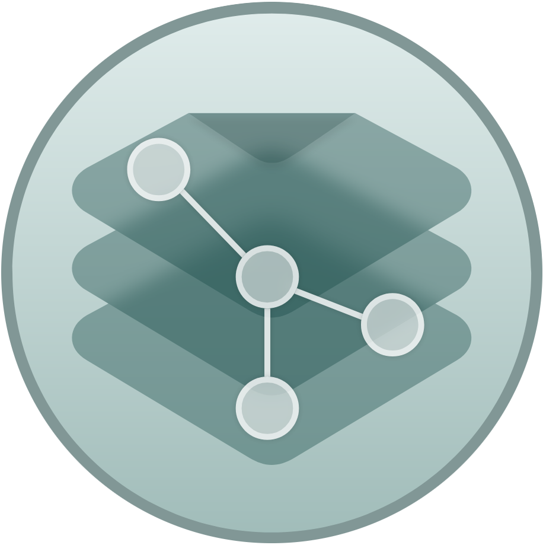

<p align="center">
  
</p>

<h1 align="center" style="text-align: center;">dotPyle</h1>

<p align="center">
    <a href="https://github.com/neovim/neovim/actions">
        
    </a>
    <a href="https://coveralls.io/github/jorgebodega/dotpyle?branch=development">
        
    </a>
</p>

<p align="center">
  <b>Manage all your configuration files with different profiles remotely.</b></br>
  <sub>Made with ❤️  by <a href="https://github.com/jorgebodega">Jorge Bodega</a> and <a href="https://github.com/perseogi">Perseo Gutierrez</a></sub>
</p>

<br/>


dotPyle is a Python implementation of a dotfile system manager, allowing users
to keep a secure copy of all program configurations remotely, create different
profiles, etc.


## Commands

### Init

This will request a git url and a git token If it is the first time you use
Dotpyle, you will need to create an empty repo on GitHub, GitLab, etc.

If you want to manage an existing repo you just need to input url and token

    dotpyle init [--url <git url>]  [--protocol (git/https)] [--token (if repo is private)]


### Add


1. Copy file to repo location
2. Delete file of path
3. Generate symbolic link to path

Examples:

1. Create program_name key
1. Create profile (default by default)
1. Set root and paths (optionally pre and post hooks)

```sh
    dotpyle add dotfile <program_name> [--profile <profile_name>] [--root
    <root_path>] [--path <dotfile_path1> [--path dotfile_path2>] ...] [--pre
    <pre_config_install_command> [--pre <...>]] [--post
    <post_config_install_command> [--post <...>]]
```

### List

    dotpyle list [--name <program_name>] [--profile <profile_name>]

### Install

    dotpyle install dotfile  <program_name> [--profile <profile_name>]

### Interacting with Git repository

User may avoid interacting directly with Dotpyle git repository

TODO: Considering only one dotpyle sync command for pulling && pussing

#### Pulling changes

This command will fetch new changes from the remote repository and check nothing will break

TODO

    dotpyle pull

#### Pushing changes (TODO)

    dotpyle push

#### Commiting changes

Commiting should be as granular and personal as possible so Dotpyle offers the
granularity you may need.

    dotpyle commit [-n <program_name> [--path=<path1> --path=<path2> ...]] [-p <profile_name>] -m <commit_message>

Examples:

- General commit for all changes on all programs and profiles installed and managed by Dotpyle:

    `dotpyle commit -m 'fix typo on vimrc'`

- Commit for all dotfiles of specific program (e.g. nvim):

    `dotpyle commit -n nvim -m 'commit message'`

- Commit for all programs (and all configuration files) of a concrete profile (e.g. work):

    `dotpyle commit -p work -m 'commit message'`

- Commit for specific program and specific dotfiles of that program for all profiles:
    (e.g. alacritty base configuration for all profiles which have alacritty)

    `dotpyle commit -n alacritty --path=alacritty.yml -m 'commit message'`

- Commit for specific program and specific dotfiles of that program on specific profile:
    (e.g. i3 configuration for i3-resurrect and status bar on home profile)

    `dotpyle commit -n i3 --path=i3-resurrect/config.json --path=i3status.conf -p home -m 'commit message'`

### Profiles

#### profile create

    dotpyle profile create <profile_name>

Creates a new profile named `<profile_name>`, if it does not exist.

#### profile list

    dotpyle profile list [<profile_name>]

#### profile change

    dotpyle profile change <profile_name> [<program_name> ...]

This option will change the configuration file to the `<profile_name>` passed for:

- all dotfiles if no `<program_name>` is passed
- all `<program_name>`'s passed

Example:

    dotpyle profile change work nvim git

Neovim work profile and Git work profile will be symlinked to its corresponding path.

    dotpyle profile change home

All dotfiles which have a 'home' profile will be symlinked to its corresponding paths.
Dotfiles which does not have a configuration for given profile will not be altered.

TBD

### Configuration

#### check

    dotpyle config check [<dotpyle_config_path>]

This command will analize Dotpyle configuration file, by default
(`XDG_CONFIG_HOME}/dotpyle/dotpyle.yml`) (or `<dotpyle_config_path>`),
returning descriptive errors.

**Info**: any other command will anayle the configuration file before
executing.  This command is useful and recomended whenever any manual change is
made on *dotpyle.yml*.


### dotpyle.yml example

Structure of yml (every thing inside [] are examples)

```yaml
# General settings for dotpyle
settings:

    # Defined profiles
    profiles:
        - default
        - [home]
        - [work]

    # TODO
    TBD

dotfiles:

    # Top level key, the name of the program for which store config files
    [program_name]:

        # Name of the profile (default profile: default)
        [profile_name]:

            # Bash commands to be executed before configuring 'profile_name'
            before:
                - [bash script 1]
                - [bash script 2]

            # Bash commands to be executed after configuring 'profile_name'
            after:
                - [bash script 1]
                - [bash script 2]

            # Base path for start storing 'paths' for 'program_name' (default $HOME)
            root: ~

            # Configuration files for 'program_name'. Subroutes will be created if they dont exist
            paths:
                - [.configuration]                # will symlink dotfiles/program_name/profile_name/.configuration => $HOME/.configuration
                - [subroute/.filerc]              # will symlink dotfiles/program_name/profile_name/subroute/.filerc => $HOME/subroute/.filerc
                - [subroute0/subroute1/filerc]    # will symlink dotfiles/program_name/profile_name/subroute0/subroute1/filerc => $HOME/subroute0/subroute1/filerc


```

Example of dotpyle.yml config file:

```yaml
settings:
    profiles:
        - default
        - windows

dotfiles:
    git:
        default:
            before:
                - sudo pacman -S git
            paths:
                - .gitconfig

        windows:
            before:
                - choco install git.install
            root: C:\Users\usr
            paths:
                - .gitconfig

    nvim:
        default:
            before:
                - sudo pacman -S neovim node
            root: ~/.config/nvim
            paths:
                - init.vim
                - after/ftplugin/ada.vim

        windows:
            before:
                - choco install neovim --pre
            root: C:\AppData\Local\nvim
            paths:
                - init.vim
                - after/ftplugin/ada.vim
```

This will be the generated file structure on the repository:

```
dotfiles
|
|-> git
|   |-> default
|   |   |-> .gitconfig
|   |-> windows
|       |-> .gitconfig
|
|-> nvim
    |-> default
    |   |-> init.vim
    |   |-> after
    |       |-> ftplugin
    |           |-> ada.vim
    |
    |-> windows
        |-> init.vim
        |-> after
            |-> ftplugin
                |-> ada.vim
```


### dotpyle.local.yml structure

Dotpyle needs to create a local configuration file in order to keep track of
your configuration on the current machine.

This file will not be tracked by
git so non conflicts will be derived when using Dotpyle on multiple computers.

Also, this file will be generated automatically by Dotpyle on 'init' command or
whenever Dotpyle can't find it.

Structure of yml (every thing inside [] are examples)

```yaml
installed:
    [program_name]:
        profile: [profile_name]
       # modified: [True|False]
        TBD
TBD
```

## TODO
- [ ] Decorator / global variable to instanciate parser and handlers
- [ ] Print centralized service with colorefull error / warning / correct output
